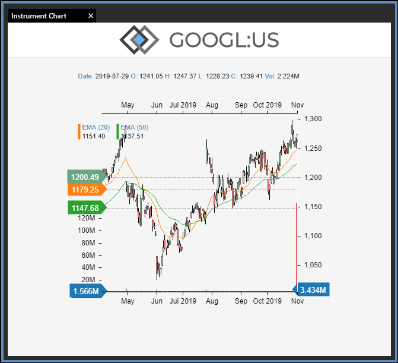

Instrument Chart ReactJS Demo Application
====

# Description
Displays a financial instrument chart.

# Instructions:
1. Clone the repository to a local directory, e.g. C:\work\instrument-chart.
2. Open a command prompt and navigate to the folder (e.g. `cd C:\work\instrument-chart`).
3. Run `npm run install`.
4. Use a browser to load [http://localhost:5005](http://localhost:5005)

# Result:

